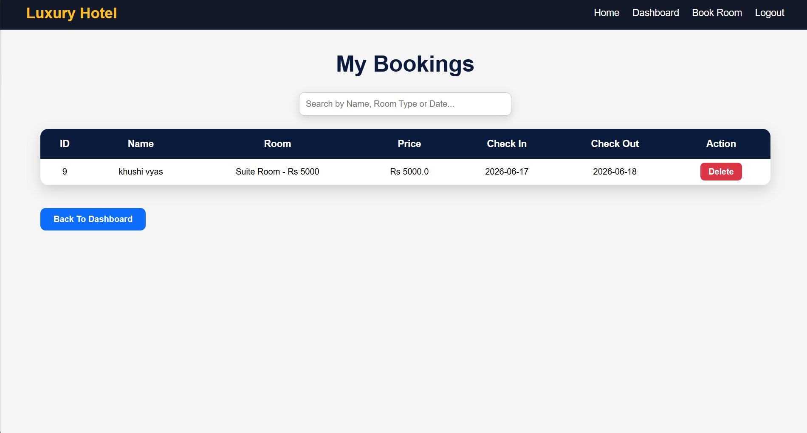

# Hotel Reservation System

A web-based Hotel Reservation System developed using Java, JSP, Servlet, JDBC and MySQL.

## Features

- User Registration
- User Login
- Room Booking
- View My Bookings
- Delete Booking
- Session Management
- Responsive User Interface

## Technologies Used

- Java
- JSP
- Servlet
- JDBC
- MySQL
- HTML
- CSS
- Apache Tomcat

## Project Screenshots

### Home Page

### Login Page

### Register Page

### Dashboard

### Book Room

### My Bookings

## Author

Khushi Vyas
